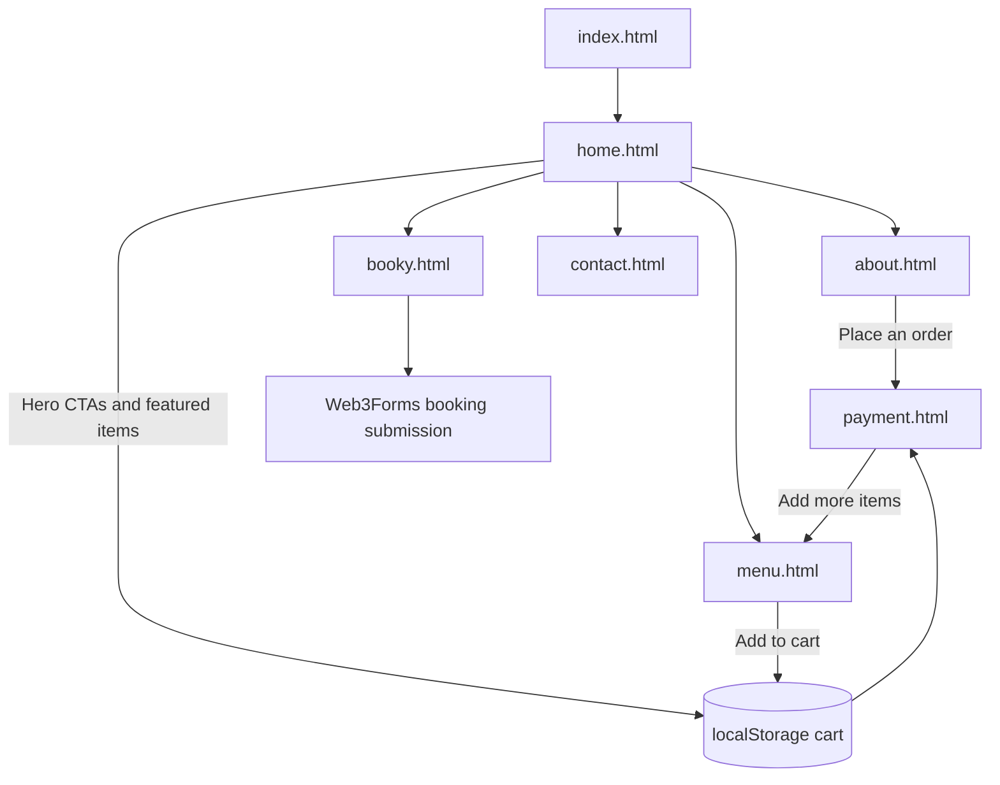

# Fein Restaurant Website

Fein is a static multi-page restaurant website built with plain HTML, CSS, and JavaScript. It includes a landing page, about page, menu, booking form, contact page, and an advanced demo checkout/payment flow.

## Demo Images

<table>
  <tr>
    <td width="33.33%"></td>
    <td width="33.33%"></td>
    <td width="33.33%"></td>
  </tr>
  <tr>
    <td align="center"><strong>Home Page</strong><br>Hero banner, offers, and featured items</td>
    <td align="center"><strong>Menu Page</strong><br>Category list, menu table, and cart actions</td>
    <td align="center"><strong>Payment Page</strong><br>Checkout flow, delivery setup, and payment summary</td>
  </tr>
</table>

## Pictorial Images

<p align="center">
  
  
  
</p>

## Flow Diagram



## Pages

- `index.html`: root entry that redirects to the home page
- `home.html`: landing page with featured items and testimonials
- `about.html`: restaurant story, values, and chefs
- `menu.html`: menu table and cart-building actions
- `booky.html`: table booking form
- `contact.html`: contact details, map, video, and location gallery
- `payment.html`: advanced demo checkout and payment experience

## Features

- Responsive multi-page restaurant layout
- Shared order/cart flow using `localStorage`
- Advanced demo checkout with:
  - live cart summary
  - promo codes
  - delivery options
  - card / mobile money / cash-on-delivery methods
  - confirmation modals
- Booking form connected to Web3Forms
- Centralized images inside `assets/images/`

## Project Structure

| Path | Type | Purpose |
| --- | --- | --- |
| `assets/images/` | Folder | Stores all project images and visual assets |
| `index.html` | Page | Root entry that redirects to the home page |
| `home.html` | Page | Main landing page |
| `about.html` | Page | Restaurant story, values, and chefs |
| `menu.html` | Page | Food menu and cart-building actions |
| `booky.html` | Page | Table booking form |
| `contact.html` | Page | Contact details, maps, and media section |
| `payment.html` | Page | Advanced checkout and payment page |
| `style.css` | Stylesheet | Main styling for the home page |
| `css2.css` | Stylesheet | Shared styling for inner pages |
| `payment.css` | Stylesheet | Styling for the checkout/payment experience |
| `site.js` | Script | Shared cart, navigation, and order flow logic |
| `payment.js` | Script | Checkout, totals, promo code, and payment interactions |

## Run Locally

Open the project folder in PowerShell and run:

```powershell
python -m http.server 8000
```

Then open:

```text
http://localhost:8000/
```

## Notes

- The checkout in `payment.html` is a demo UI flow, not a real payment gateway.
- The cart is stored in browser `localStorage`.
- Remote fonts and Font Awesome require internet access.
