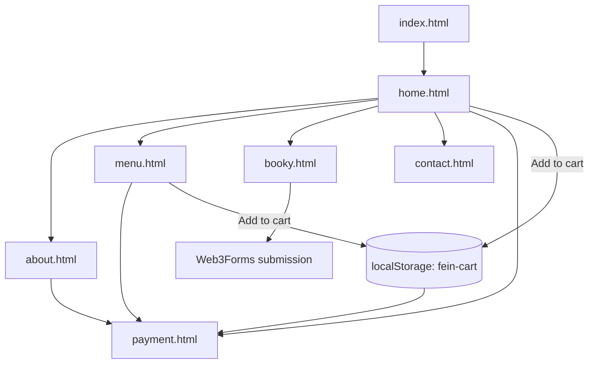

# Fein Restaurant Website

Fein is a static multi-page restaurant website built with plain HTML, CSS, and JavaScript. It includes a landing experience, menu browsing, table booking, contact details, and a client-side checkout demo that keeps the cart in `localStorage`.

There is no build step or package installation required. You can run the site directly from a lightweight local server.

## Preview

<table>
  <tr>
    <td width="33.33%"></td>
    <td width="33.33%"></td>
    <td width="33.33%"></td>
  </tr>
  <tr>
    <td align="center"><strong>Home</strong><br>Hero section, featured meals, offers, and testimonials</td>
    <td align="center"><strong>Menu</strong><br>Menu table, quick ordering, and cart actions</td>
    <td align="center"><strong>Checkout</strong><br>Delivery setup, promo codes, and payment demo</td>
  </tr>
</table>

## Tech Stack

- HTML5
- CSS3
- Vanilla JavaScript
- Browser `localStorage` for cart persistence
- Web3Forms for the table booking form

## Key Features

- Multi-page restaurant site with a dedicated page for each core section
- Shared cart flow between `home.html`, `menu.html`, and `payment.html`
- Checkout demo with:
  - quantity updates
  - delivery speed selection
  - promo codes
  - tax and service fee calculation
  - card, mobile money, and cash-on-delivery UI states
- Table booking form connected to Web3Forms
- Responsive navigation with mobile menu toggle
- Visual assets organized under `assets/images/`

## Checkout Demo Rules

The checkout experience in `payment.html` is driven by `payment.js` and currently uses these demo values:

| Rule | Value |
| --- | --- |
| Currency | `RWF` |
| Standard delivery | `1,200 RWF` |
| Priority delivery | `2,200 RWF` |
| Scheduled delivery | `1,500 RWF` |
| Service fee | `650 RWF` |
| Tax rate | `8%` |
| Cart storage key | `fein-cart` |

### Promo Codes

| Code | Effect |
| --- | --- |
| `FEIN10` | 10% off the food subtotal |
| `CRUNCH500` | 500 RWF off orders from 3,000 RWF |
| `FREESHIP` | Removes the delivery fee |

## Page Map



## Pages

| File | Purpose |
| --- | --- |
| `index.html` | Redirect entry that sends visitors to `home.html` |
| `home.html` | Main landing page with featured dishes, offers, and testimonials |
| `about.html` | Brand story, restaurant intro, and team section |
| `menu.html` | Full menu table with add-to-cart actions |
| `booky.html` | Table reservation form |
| `contact.html` | Contact details, media, and location-focused content |
| `payment.html` | Demo checkout and payment experience |

## Project Structure

| Path | Purpose |
| --- | --- |
| `assets/images/` | Photos, illustrations, and README preview assets |
| `style.css` | Main styling for the home page |
| `css2.css` | Shared styling for inner pages |
| `payment.css` | Checkout-specific styling |
| `site.js` | Shared cart, navigation, toast, and cross-page order flow |
| `payment.js` | Checkout summary, promo, delivery, and payment interactions |

## Run Locally

This project does not need a build step.

1. Open the project folder in PowerShell.
2. Start a local server:

```powershell
python -m http.server 8000
```

3. Open `http://localhost:8000/` in your browser.

You can also open `index.html` directly, but a local server gives more reliable browser behavior during testing.

## Suggested QA Flow

1. Open `home.html` and use a featured meal button to confirm it jumps to checkout with an item added.
2. Open `menu.html` and add several rows to confirm the cart badge updates correctly.
3. Open `payment.html` and test all three promo codes.
4. Switch between `card`, `mobile`, and `cash` payment tabs to confirm validation states.
5. Submit the booking form on `booky.html` only after replacing the default Web3Forms key with your own.

## Customization

- Update menu item names and prices in `home.html` and `menu.html`
- Keep visible menu text accurate because the cart logic reads item names and pricing from the page markup
- Replace the booking form `access_key` in `booky.html` with your own Web3Forms key
- Adjust promo codes, fees, and tax rules in `payment.js`
- Swap images inside `assets/images/` to match your own restaurant brand
- Edit copy, phone number, and email text directly in the HTML pages

## Important Notes

- `payment.html` is a front-end demo checkout, not a real payment gateway integration.
- Cart data is stored in browser `localStorage` under the `fein-cart` key.
- Booking submissions depend on Web3Forms and require internet access.
- Google Fonts and Font Awesome are loaded from external CDNs, so those assets also require internet access.

## Screenshot Assets

<p align="center">
  
  
  
</p>
