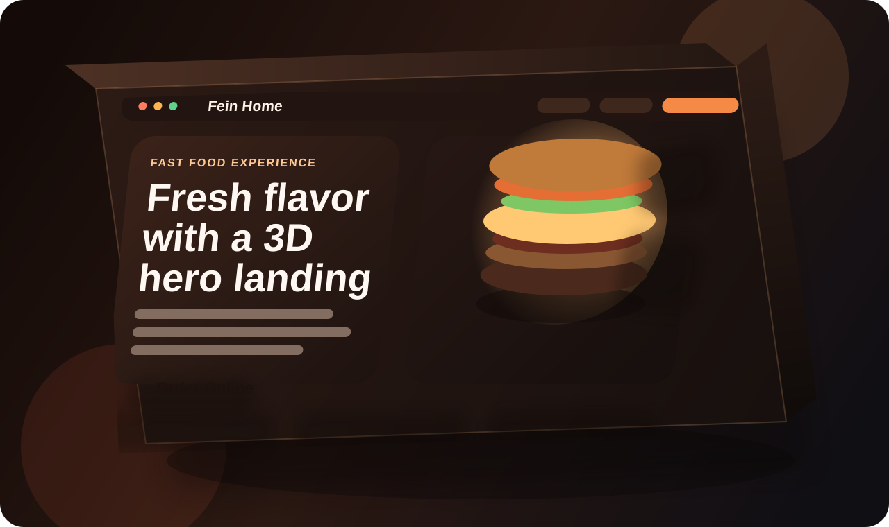
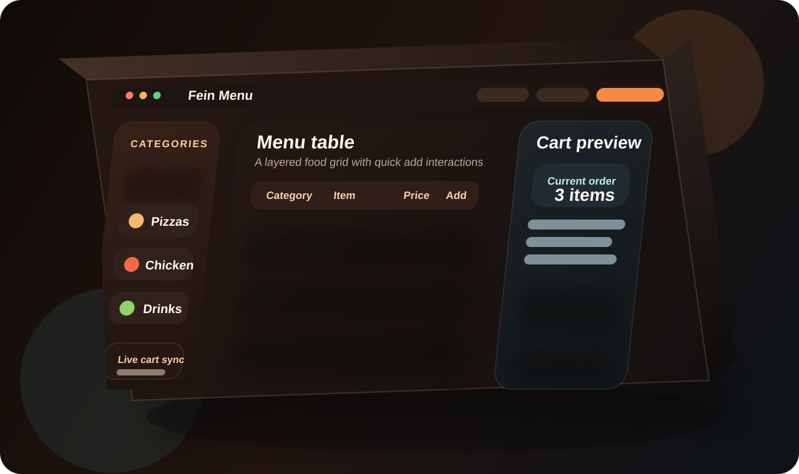
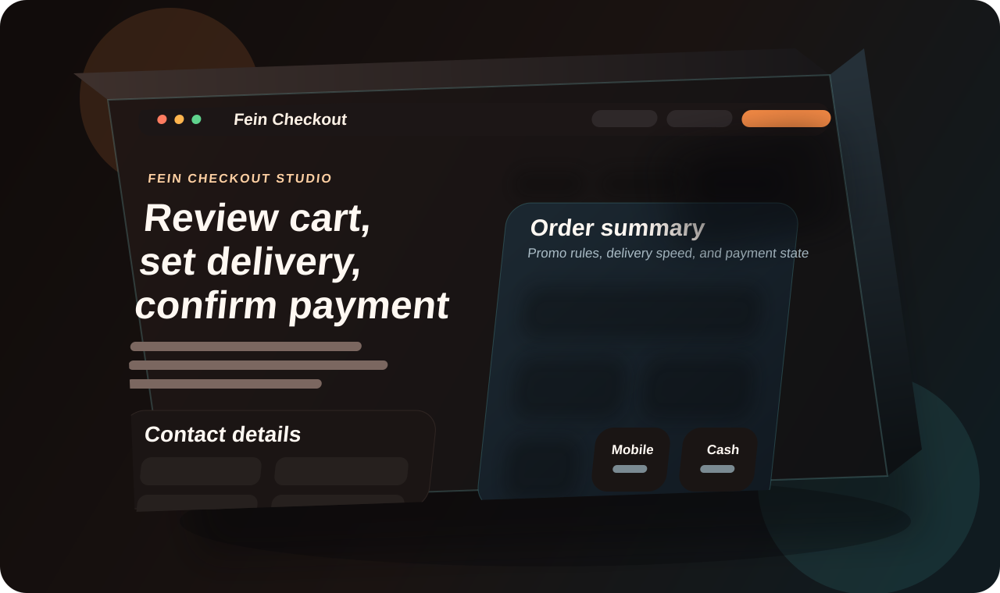
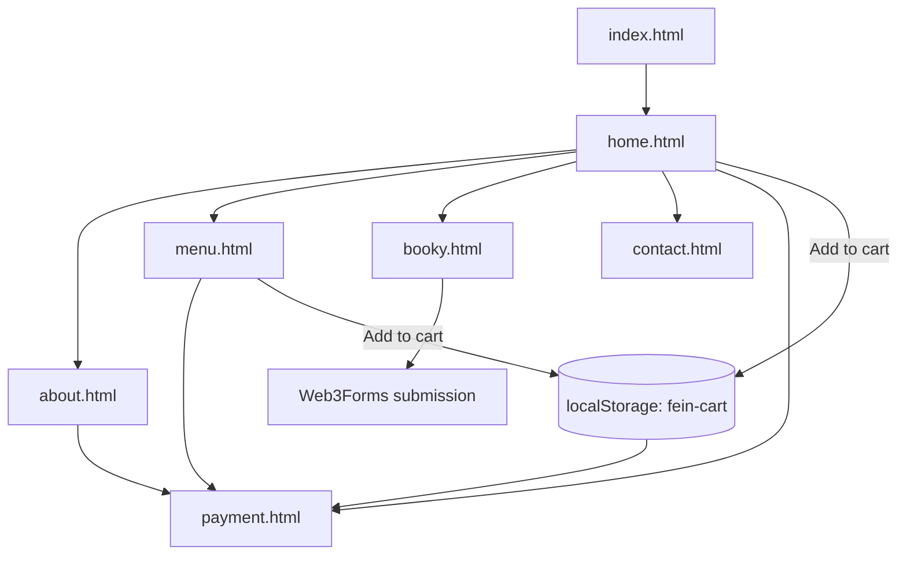
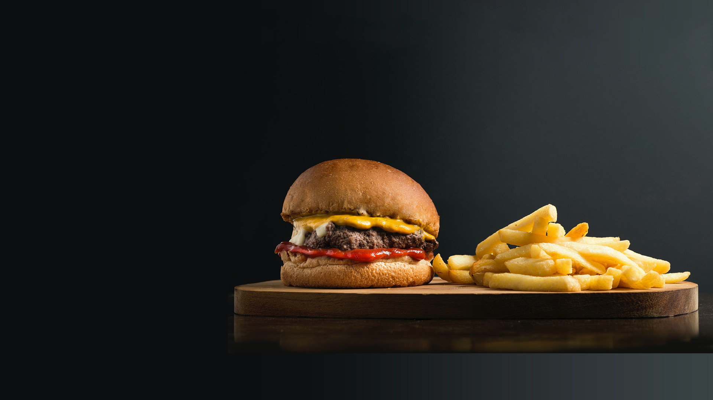
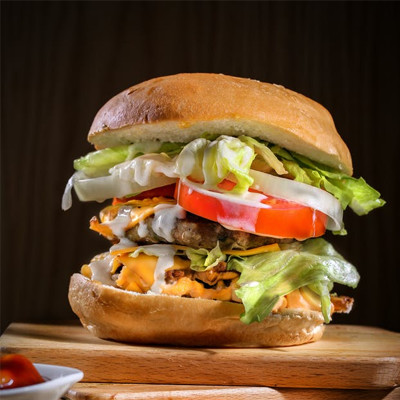

# Fein Restaurant Website :

Fein is a static multi-page restaurant front end built with plain HTML, CSS, and JavaScript. It presents a complete restaurant browsing journey with landing content, menu discovery, cart persistence, table booking, contact information, and a polished client-side checkout demo.

The project is intentionally lightweight: there is no build pipeline, no package manager, and no framework runtime. Everything runs directly in the browser, which makes the codebase simple to host, customize, and hand off.

## Preview :

<table>
  <tr>
    <td width="33.33%"></td>
    <td width="33.33%"></td>
    <td width="33.33%"></td>
  </tr>
  <tr>
    <td align="center"><strong>Home</strong><br>Hero section, featured meals, offers, and testimonials</td>
    <td align="center"><strong>Menu</strong><br>Menu table, quick ordering, and cart actions</td>
    <td align="center"><strong>Checkout</strong><br>Delivery setup, promo codes, and payment demo</td>
  </tr>
</table>

## Experience Highlights:

- Multi-page browsing flow from landing page to menu, booking, and checkout
- Shared cart state between pages using browser `localStorage`
- Checkout UI with delivery modes, promo logic, validation, and payment method states
- Table booking form connected to Web3Forms without a backend
- Static-site friendly structure that can be deployed to any HTML host

## Tech Stack:

- HTML5
- CSS3
- Vanilla JavaScript
- Browser `localStorage` for cart persistence
- Browser `sessionStorage` for cross-page toast messages
- Web3Forms for the table booking form

## Architecture Overview :

| Layer | Responsibility |
| --- | --- |
| `index.html` | Redirect entry point that sends users to `home.html` |
| `home.html`, `about.html`, `menu.html`, `booky.html`, `contact.html` | Main marketing and reservation pages |
| `payment.html` | Checkout experience and order confirmation modal |
| `style.css` | Styling dedicated to the home page |
| `css2.css` | Shared styling for inner content pages |
| `payment.css` | Checkout-specific layout and interaction styling |
| `site.js` | Shared navigation actions, cart badge, add-to-cart behavior, toast messaging, and page-to-page checkout flow |
| `payment.js` | Checkout totals, promo logic, quantity controls, delivery handling, payment state management, and demo confirmation flow |
| `assets/images/` | Restaurant imagery and README preview assets |

## Key Features:

- Multi-page restaurant site with a dedicated page for each major section
- Shared cart flow between `home.html`, `menu.html`, and `payment.html`
- Checkout demo with quantity controls, delivery mode selection, promo support, and payment validation
- Toast feedback and cart badge updates across pages
- Table booking form connected to Web3Forms
- Responsive navigation with mobile menu toggle
- Visual assets organized under `assets/images/`

## Checkout Demo Rules:

The checkout experience in `payment.html` is driven by `payment.js` and currently uses these demo values:

| Rule | Value |
| --- | --- |
| Currency | `RWF` |
| Standard delivery | `1,200 RWF` |
| Priority delivery | `2,200 RWF` |
| Scheduled delivery | `1,500 RWF` |
| Service fee | `650 RWF` |
| Tax rate | `8%` |
| Cart storage key | `fein-cart` |

### Promo Codes:

| Code | Effect |
| --- | --- |
| `FEIN10` | 10% off the food subtotal |
| `CRUNCH500` | 500 RWF off orders from 3,000 RWF |
| `FREESHIP` | Removes the delivery fee |

## Client-Side Data Contract :

### Persistent Storage Keys :

| Key | Storage | Purpose |
| --- | --- | --- |
| `fein-cart` | `localStorage` | Persists the checkout basket across pages |
| `fein-flash` | `sessionStorage` | Queues temporary toast messages during navigation |

### Cart Item Shape

`site.js` and `payment.js` both expect cart items to follow this structure:

```json
[
  {
    "name": "Classic Burger",
    "price": "4 900 RWF",
    "quantity": 2
  }
]
```

If you extend the cart logic, keep the `name`, `price`, and `quantity` fields stable unless you also update both scripts.

## Page Map :



## User Journey :

1. Visitors land on `home.html` through the redirect in `index.html`.
2. They can jump into featured dishes, menu browsing, booking, or direct checkout actions.
3. Add-to-cart actions in the landing and menu pages write cart data to `localStorage`.
4. `payment.html` reads the saved cart, calculates totals, and validates the selected payment path.
5. Booking requests from `booky.html` are submitted directly to Web3Forms.

## Pages :

| File | Purpose |
| --- | --- |
| `index.html` | Redirect entry that sends visitors to `home.html` |
| `home.html` | Main landing page with featured dishes, offers, and testimonials |
| `about.html` | Brand story, restaurant intro, and team section |
| `menu.html` | Full menu table with add-to-cart actions |
| `booky.html` | Table reservation form |
| `contact.html` | Contact details, media, and location-focused content |
| `payment.html` | Demo checkout and payment experience |

## Project Structure

| Path | Purpose |
| --- | --- |
| `assets/images/` | Photos, illustrations, and README preview assets |
| `style.css` | Main styling for the home page |
| `css2.css` | Shared styling for inner pages |
| `payment.css` | Checkout-specific styling |
| `site.js` | Shared cart, navigation, toast, and cross-page order flow |
| `payment.js` | Checkout summary, promo, delivery, and payment interactions |

## Run Locally

This project does not need a build step.

1. Open the project folder in PowerShell.
2. Start a local server:

```powershell
python -m http.server 8000
```

3. Open `http://localhost:8000/` in your browser.

You can also open `index.html` directly, but a local server gives more reliable browser behavior during testing.

## Deployment Notes

- This project can be deployed to GitHub Pages, Netlify, Vercel static hosting, or any standard web server.
- Because the site is fully static, the deployment output is the repository itself.
- External dependencies such as Google Fonts, Font Awesome, and Web3Forms still require internet access in production.
- If you deploy under a custom domain or subdirectory, the relative file links will continue to work because navigation is file-based.

## Suggested QA Flow

1. Open `home.html` and use a featured meal button to confirm it jumps to checkout with an item added.
2. Open `menu.html` and add several rows to confirm the cart badge updates correctly.
3. Open `payment.html` and test all three promo codes.
4. Switch between `card`, `mobile`, and `cash` payment tabs to confirm validation states.
5. Submit the booking form on `booky.html` only after replacing the default Web3Forms key with your own.

## Maintenance Notes

- `site.js` reads item names and prices directly from the visible page markup, so major DOM changes can affect cart behavior.
- The menu page add-to-cart logic depends on table row structure in `menu.html`.
- Home page quick-order logic depends on the current `.item`, `.today`, and offer section layouts.
- `payment.js` expects specific form fields and IDs to exist in `payment.html`; renaming those elements requires matching script updates.
- The checkout flow is demo-only and does not send real payment data to a server.

## Customization

- Update menu item names and prices in `home.html` and `menu.html`
- Keep visible menu text accurate because the cart logic reads item names and pricing from the page markup
- Replace the booking form `access_key` in `booky.html` with your own Web3Forms key
- Adjust promo codes, fees, and tax rules in `payment.js`
- Swap images inside `assets/images/` to match your own restaurant brand
- Edit copy, phone number, and email text directly in the HTML pages

## Important Notes

- `payment.html` is a front-end demo checkout, not a real payment gateway integration.
- Cart data is stored in browser `localStorage` under the `fein-cart` key.
- Booking submissions depend on Web3Forms and require internet access.
- Google Fonts and Font Awesome are loaded from external CDNs, so those assets also require internet access.

## Extension Ideas

- Replace the demo checkout with a real backend order API
- Move menu data into JSON so content and cart behavior are driven by a single source of truth
- Add order history or saved favorites using the existing browser storage pattern
- Improve accessibility with stronger focus states, landmark structure, and reduced-motion handling
- Add analytics or event tracking around booking and checkout interactions

## Screenshot Assets

<p align="center">
  
  
  
</p>

## Author

Aayush Sharma
